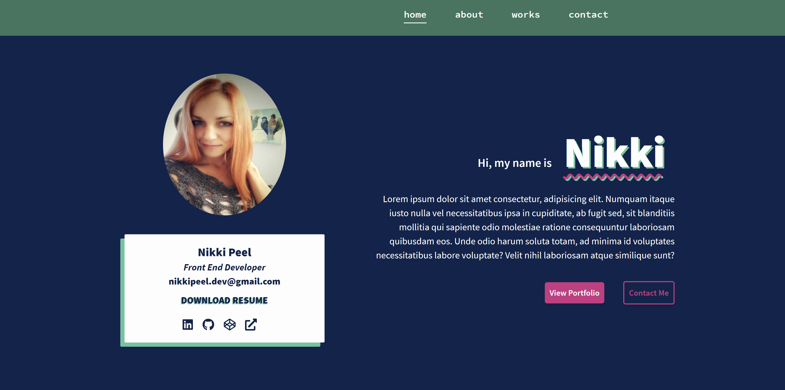
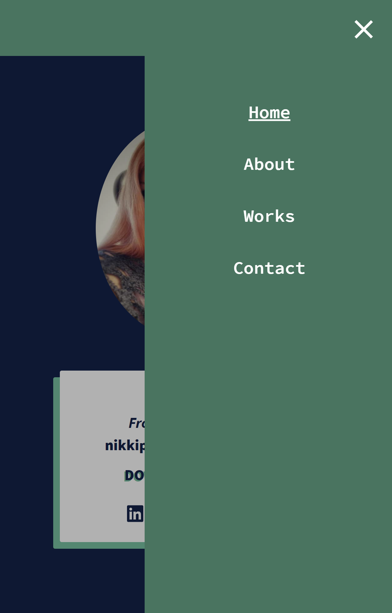

### **Portfolio Redesign with Gatsby and Tailwind**

[Current portfolio (Bootstrap v4)](https://nikkipeel.com)

*Bootstrapped with* [gatsby-starter-default](https://github.com/gatsbyjs/gatsby-starter-default), *uses* [react-burger-menu](https://negomi.github.io/react-burger-menu/) *for slide-out mobile menu*

#### **Todos**:
- Finish layout
- Create json file with project data
- Add transition animations

